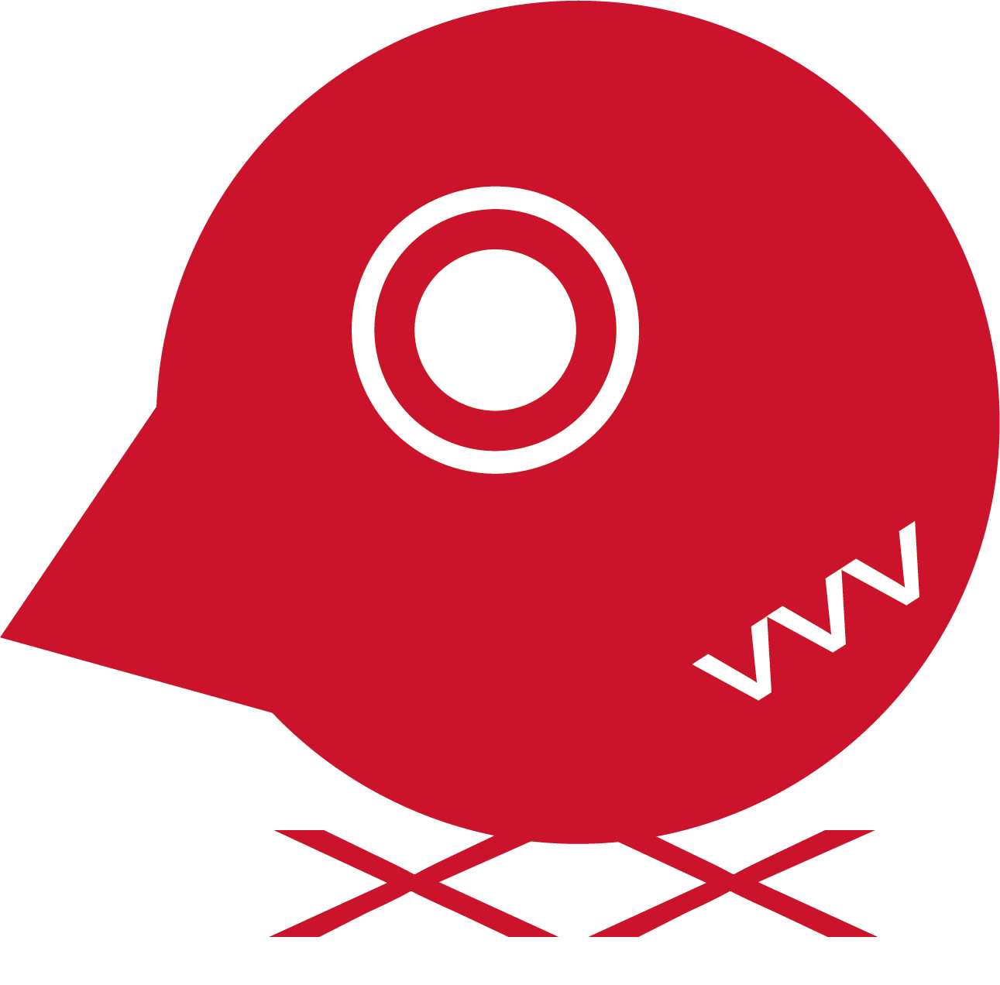
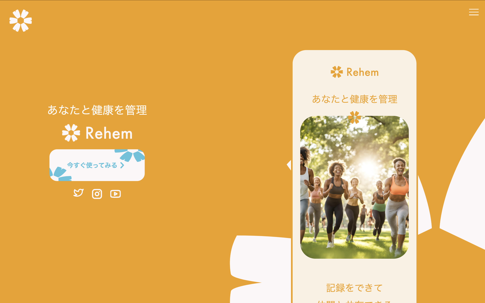
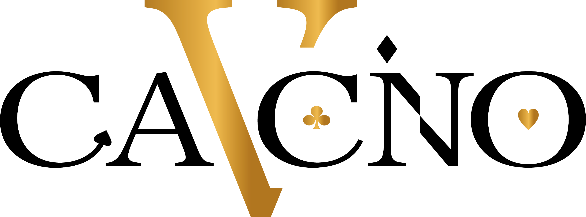
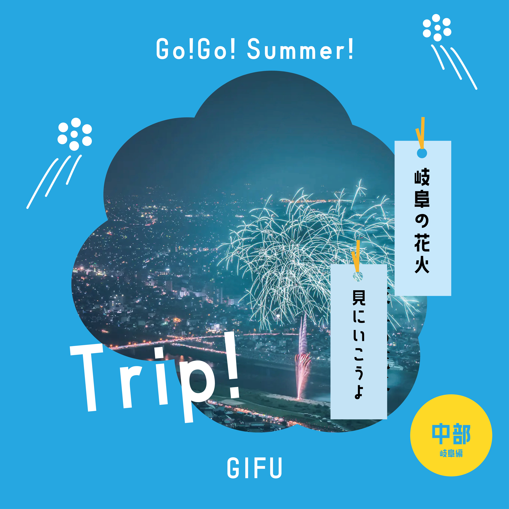
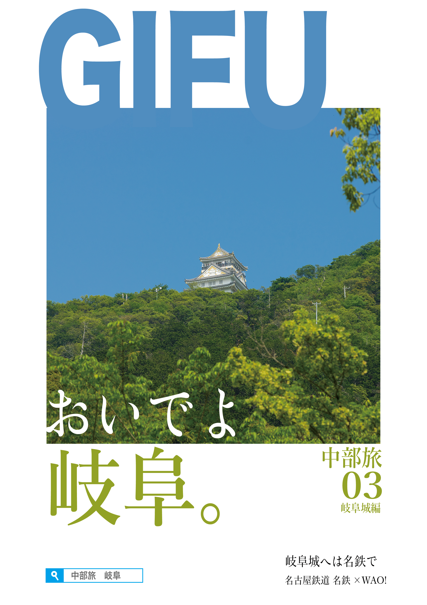

# デザイン作品集

自分がデザインしたもの不定期に貼っていきます
  - [figmaはこちら](https://www.figma.com/@ee108319_14a3_4)
    

## 2025 文化祭用SNS VANX ロゴ

### 作品概要
使用ソフト　Illustrator

**文化祭のSNSとして親しみやすいかつ一目でわかるデザインを意識しカラーもVANTANの赤にしました。 
ロゴに鳥の要素を入れることで情報が鳥のように飛び交って欲しいという願いも込められています。**

 

## 2025 lpサイト

### 作品概要
使用　Figma html/css 

詳しくははこちらから　https://github.com/reonalddekapurio/suntory-lp

 

## 2025 文化祭制作物　CASINO ロゴ

### 作品概要
使用ソフト　Illustrator

**高級感を色で表現しつつトランプの要素を散りばめることで娯楽であることを同時に表現した遊びのある作品のなります。 
推しポイントは金色の光沢感です**

 

## 架空　夏イベントバナー

### 作品概要
使用ソフト　Illustrator

**岐阜の花火のバナーを制作してみました。 
涼しげのあるカラーを使いポップさを意識し柔らかい印象になるようにしました。**

 

## 架空宣伝ポスター

### 作品概要
使用ソフト　Illustrator

**架空の岐阜へ旅行宣伝をするポスターを作成しました。名鉄主体イベントの設定で作成しました。 
シンプルに情報をまとめつつ強調したい要素を大きくすることで情報を見せることを意識しました。**

 

## 2025 9月デザイン審査会課題　yolu架空バナー

### 作品概要
使用ソフト　Illustrator Photoshop

**9月の審査会の課題として出された制作物です。透明感や統一感があるかを意識しカラーなども 
ターゲットである女性などが入りやすいような雰囲気をこの作品で作りました。**

 

